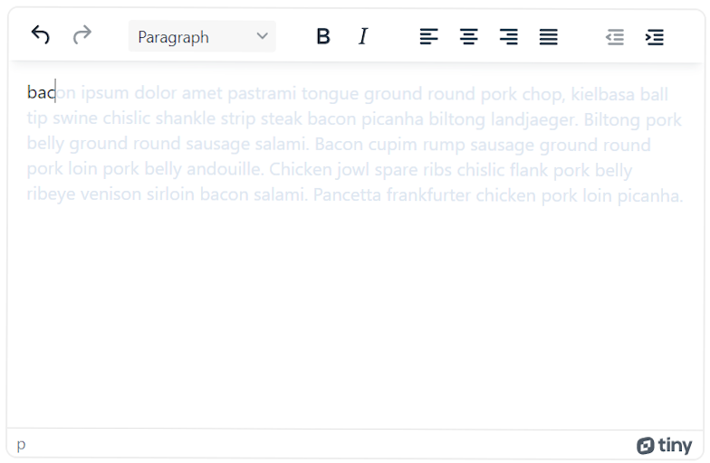

# TinyMCE suggestions
TinyMCE suggestions is a an auto-complete plugin.

This plugin doesn't need a special char to trigger the suggestion function and doesn't popup a list of suggestions.
Instead this plugin is only triggered by typing.

To retrieve the suggested word completion, this plugin searches from a list of words, or through a user defined function, for example to search from an API.

The completion function can be triggered by pressing the `Tab` key in the keyboard.



### Demo

INSERT LINK HERE

### Features

TODO

### Example

```javascript
tinymce.init({
    selector: "#textarea",  // change this value according to your HTML
    plugins: "suggestions"
});
```

### Options
These options affect the execution of the suggestions of the `suggestions` plugin.

### `terms_list`
This option is an array containing a list of `string` terms where the plugin will search to complete the typed word.

```javascript
tinymce.init({
    selector: "#textarea",  // change this value according to your HTML
    plugins: "suggestions",
    terms_list: [
        'Afghanistan',
        'Albania',
        'Algeria',
        'Andorra'
    ]
});
```

### `min_search_length`
This option is an integer which represent the minimum word length before triggering the suggestion function.
The default value is `3`.

```javascript
tinymce.init({
    selector: "#textarea",  // change this value according to your HTML
    plugins: "suggestions",
    min_search_length: 3
});
```

### `suggestion_node_id`
This option is the id of the TinyMCE DOM node containing the suggestion.
The default value is `suggestionNodeId`

```javascript
tinymce.init({
    selector: "#textarea",  // change this value according to your HTML
    plugins: "suggestions",
    suggestion_node_id: "suggestionNodeId"
});
```

### `suggestion_text_color`
This option defines the html hex color of the suggestion completion text.
The default value is `#dee7f1`.

```javascript
tinymce.init({
    selector: "#textarea",  // change this value according to your HTML
    plugins: "suggestions",
    suggestion_text_color: "#dee7f1"
});
```

### `debounce_time`
This option is an integer which defines the delay in milliseconds which the plugin waits when you type before triggering the suggestion function.
The default value is `250` ms.

```javascript
tinymce.init({
    selector: "#textarea",  // change this value according to your HTML
    plugins: "suggestions",
    debounce_time: 250
});
```

### `search_function`
This option is a user defined `async` function which is used to get the suggested word.
The return value is a string or an array of strings.
The `keyword` argument of the function represents the word already typed in TinyMCE editor.
The default value is `null`.

```javascript
tinymce.init({
    selector: "#textarea",  // change this value according to your HTML
    plugins: "suggestions",
    search_function: async ( keyword ) => {
        const response = await fetch(`https://example.com/api/?keyword=${keyword}`);
        
        if(response.ok){
            const jsonResponse = await response.json();
            return jsonResponse;
        }else{
           throw new Error("ERR")
        }
    }
});
```
